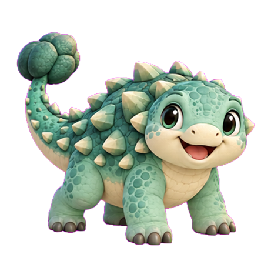

# 🦕 Desktop Dino

> **⚠️ Dieses Projekt befindet sich aktuell in aktiver Entwicklung.**  
> Features können sich ändern, fehlen oder noch nicht vollständig sein.

Ein niedlicher Desktop-Begleiter-Dino für Windows, der auf deinem Bildschirm lebt, gräbt, schläft und mit dir interagiert.

<p align="center">
  
  &nbsp;&nbsp;&nbsp;
  
</p>

---

## ✨ Features

- 🦕 **Lebendiger Desktop-Dino** – läuft, schläft, schaut sich um, wedelt mit dem Schwanz
- ⛏️ **Desktop-Grabungen** – Grabungsstellen erscheinen zufällig auf dem Desktop, Dino reist hin und gräbt Fundstücke aus
- 🍂 **Blätter-Event** – Blätter fallen auf den Desktop, klick sie weg und Dino holt sie ab
- 🪲 **Käfer-Event** – Ein Käfer krabbelt über den Desktop, fange ihn mehrfach
- 💤 **Schlaf & AP-System** – Dino regeneriert Abenteuerpunkte im Schlaf, die für Aktivitäten benötigt werden
- 🎒 **Sammelalbum** – Fundstücke aus Grabungen werden gesammelt
- 🏠 **Dinohaus** – Dino kann nach Hause geschickt werden
- 🎨 **Skins** – verschiedene Dino-Outfits freischaltbar
- 🏆 **Erfolge** – Achievements für Meilensteine
- 📊 **Profil & Statistiken** – Level, XP, Coins, Spielzeit

---

## 🎮 Bedienung

| Aktion | Beschreibung |
|--------|-------------|
| **Klick auf Dino** | Interaktionsmenü öffnen / schließen |
| **Rechtsklick** | Kontextmenü (Schlafen / Aufwecken) |
| **Blatt anklicken** | Dino läuft hin, Belohnung erhalten |
| **Käfer anklicken** | Käfer fangen (mehrfach), Belohnung pro Treffer |
| **Grabungsstelle anklicken** | Dino zur Grabung schicken |

---

## 🗺️ Gebiete

| Gebiet | Inhalte |
|--------|---------|
| 🌸 Garten | Blumen-Fundstücke, Blätter, Käfer |
| 🌲 Wald | Holz-Fundstücke, Blätter, Käfer |
| 🏖️ Strand | Sand-Fundstücke, Käfer |
| 🕳️ Höhle | Stein-Fundstücke |
| ❄️ Schnee | Eis-Fundstücke |

---

## 🛠️ Tech Stack

- **Plattform:** Windows 10/11
- **Framework:** .NET 8, WPF (C#)
- **Ziel:** `net8.0-windows`, `win-x64`

---

## 🚧 In Entwicklung

Folgende Features sind geplant oder in Arbeit:

- [ ] Gebietsabhängige Event-Grafiken (Blätter, Käfer je nach Gebiet)
- [ ] Weitere Desktop-Aktivitäten pro Gebiet
- [ ] Käfer mit gebietsabhängiger Geschwindigkeit
- [ ] Mehr Skins & Accessoires
- [ ] Weitere Erfolge

---

## 📦 Build

```bash
dotnet publish DinoDesktopCompanion/DinoDesktopCompanion.csproj -c Release -o ./publish
```

---

*Made with 🦕 by X4rinia*
