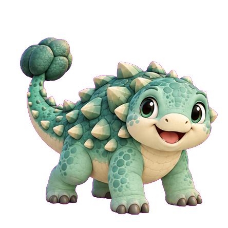

# Desktop Dino

> **Dieses Projekt befindet sich aktuell in aktiver Entwicklung.**  
> Features können sich ändern, fehlen oder noch nicht vollständig sein.

Ein niedlicher Desktop-Begleiter-Dino für Windows, der auf deinem Bildschirm lebt, gräbt, schläft und mit dir interagiert.

<p align="center">
  
</p>

---

## Features

- **Lebendiger Desktop-Dino** – läuft, schläft, schaut sich um, wedelt mit dem Schwanz
- **Desktop-Grabungen** – Grabungsstellen erscheinen zufällig auf dem Desktop, Dino reist hin und gräbt Fundstücke aus
- **Gebietsobjekte** – Garten nutzt Blüten, Wald Blätter, Strand Muscheln, Schneegebiet Eiskristalle und Höhle Pilze
- **Sternschnuppen-Event** – Ein beweglicher Stern erscheint zufällig und muss je nach Stufe 3, 5, 8 oder 12 Mal angeklickt werden; die Belohnung gibt es erst beim vollständigen Abschluss
- **Schlaf & AP-System** – Dino regeneriert Abenteuerpunkte im Schlaf, die für Aktivitäten benötigt werden
- **Sammelalbum** – Fundstücke aus Grabungen werden gesammelt
- **Dinohaus** – Dino kann nach Hause geschickt und das Haus ausgebaut werden; Ausbauten können beim Sternschnuppen-Abschluss garantiert 1, 2 oder 3 AP auffüllen
- **Skins** – verschiedene Dino-Outfits freischaltbar
- **Erfolge** – Achievements für Meilensteine
- **Profil & Statistiken** – Level, XP, Coins, Spielzeit und eine optionale Profilnotiz mit maximal 500 Zeichen

---

## Bedienung

| Aktion | Beschreibung |
|--------|-------------|
| **Klick auf Dino** | Interaktionsmenü öffnen / schließen |
| **Gebietsobjekt anklicken** | Dino läuft hin und sammelt das Objekt ein |
| **Stern anklicken** | Beweglichen Stern vollständig anklicken; Klicks verbrauchen keine AP und funktionieren auch bei 0 AP |
| **Grabungsstelle anklicken** | Dino zur Grabung schicken |

---

## Gebiete

| Gebiet | Inhalte |
|--------|---------|
| Garten | Blumen-Fundstücke, Blüten, Sternschnuppen |
| Wald | Holz-Fundstücke, Blätter, Sternschnuppen |
| Strand | Sand-Fundstücke, Muscheln, Sternschnuppen |
| Höhle | Stein-Fundstücke, Pilze, Sternschnuppen |
| Schneegebiet | Eis-Fundstücke, Eiskristalle, Sternschnuppen |

---

## Tech Stack

- **Plattform:** Windows 10/11
- **Framework:** .NET 8, WPF (C#)
- **Ziel:** `net8.0-windows`, `win-x64`

---

## In Entwicklung

Folgende Features sind geplant oder in Arbeit:

- [ ] Weitere Desktop-Aktivitäten pro Gebiet
- [ ] Mehr Skins & Accessoires
- [ ] Weitere Erfolge

---

## Build

Die aktuelle fertige Windows-Version gibt es im [GitHub-Release v1.2.0](https://github.com/x4rinia/Desktop-Dino/releases/tag/v1.2.0).

Zum eigenen Erstellen:

```bash
dotnet publish DinoDesktopCompanion/DinoDesktopCompanion.csproj -c Release -o ./publish
```

---

*Made with love by X4rinia*
